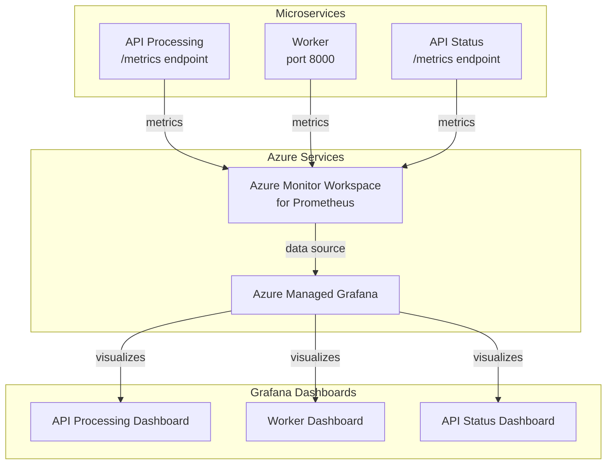

# Monitoring Infrastructure

This document describes the monitoring infrastructure used in the microservices architecture, which leverages Prometheus metrics and Azure Managed Grafana for visualization.

## Architecture Overview

## Prometheus Metrics Collection

Each microservice in the architecture is instrumented with Prometheus metrics:

### API Processing Service
- Exposes metrics at `/metrics` endpoint
- Tracks request counts and latency
- Monitors blob upload sizes
- Counts messages sent to Service Bus

### Worker Service
- Exposes metrics on port 8000
- Tracks message processing counts and failures
- Measures processing time and OpenAI API performance
- Uses gauges to monitor in-progress messages

### API Status Service
- Exposes metrics at `/metrics` endpoint
- Tracks found vs. pending results
- Monitors request latency and error counts

## Azure Infrastructure

The monitoring infrastructure is built on Azure services:

### Azure Monitor Workspace for Prometheus
- Centralized collection point for all Prometheus metrics
- Provides a scalable and managed metrics storage solution
- Configured with appropriate IAM for access control

### Azure Managed Grafana
- Integrated with Azure Monitor Workspace as a data source
- Provides secure, managed dashboarding capabilities
- Configured with IAM permissions for monitoring access

## Grafana Dashboards

Custom dashboards are created for monitoring each service:

### API Processing Dashboard
- Request rate and latency visualizations
- Blob upload metrics tracking
- Service Bus message monitoring

### Worker Dashboard
- Message processing metrics, including success and failure rates
- OpenAI API performance tracking
- In-progress job monitoring using gauges

### API Status Dashboard
- Request metrics with latency percentiles
- Visualization of completed vs. pending results
- Error monitoring panels

## Terraform Configuration

The entire monitoring infrastructure is defined in Terraform:
- `monitoring.tf` - Defines the Azure resources (Monitor Workspace and Managed Grafana)
- `dashboards.tf` - Defines the Grafana dashboards for each service