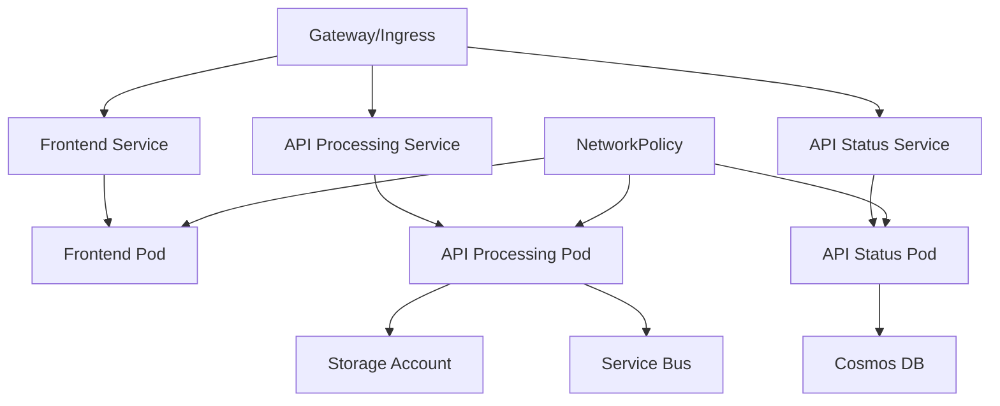

# Demo Apps Helm Chart

A production-ready Helm chart for deploying demo applications with modern Gateway API support and enterprise security features.

## Features

- **Modern Networking**: Gateway API support with backward compatibility for Ingress API
- **Enterprise Security**: Automatic NetworkPolicy, security headers, and CORS configuration
- **High Availability**: Built-in HPA, PDB, and multi-replica deployment
- **Observability**: Application Insights integration and monitoring-ready
- **Microservices Architecture**: Three loosely coupled services (frontend, api-processing, api-status)

## Quick Start

### Prerequisites

For Gateway API (recommended):
```bash
# Install Gateway API CRDs
kubectl apply -f https://github.com/kubernetes-sigs/gateway-api/releases/download/v1.0.0/standard-install.yaml

# Install a Gateway API controller (example: nginx-gateway-fabric)
kubectl apply -f https://github.com/nginxinc/nginx-gateway-fabric/releases/download/v1.0.0/nginx-gateway-fabric.yaml
```

### Installation

#### Using Gateway API (Recommended)
```bash
# Create custom values for Gateway API
cat > gateway-values.yaml << EOF
ingress:
  enabled: false

gateway:
  enabled: true
  gatewayClassName: "nginx"
  hostname: "your-domain.com"
  tls:
    enabled: true
    secretName: "your-tls-secret"
EOF

# Install the chart
helm install demo-apps . -f gateway-values.yaml
```

#### Using Traditional Ingress API
```bash
# Install with default values (uses Ingress API)
helm install demo-apps .

# Or customize ingress settings
helm install demo-apps . --set ingress.hosts[0].host=your-domain.com
```

## Architecture



## Services

### Frontend
- **Technology**: React.js application
- **Purpose**: User interface for image processing
- **Port**: 80
- **Path**: `/`

### API Processing
- **Technology**: Python FastAPI
- **Purpose**: Image processing and analysis
- **Port**: 8000 (mapped to 80)
- **Path**: `/api/processing`

### API Status
- **Technology**: Python FastAPI
- **Purpose**: Processing status and results
- **Port**: 8000 (mapped to 80)
- **Path**: `/api/status`

## Configuration

### Gateway API vs Ingress API

| Configuration | Gateway API | Ingress API |
|---------------|-------------|-------------|
| **Status** | ✅ Recommended | ⚠️ Deprecated |
| **Enable** | `gateway.enabled: true` | `ingress.enabled: true` |
| **Security** | Enhanced (NetworkPolicy, Headers) | Basic |
| **Features** | Advanced routing, traffic splitting | Basic routing |

### Key Configuration Options

```yaml
# Networking (choose one)
ingress:
  enabled: true    # Traditional Ingress API
  className: "nginx"

gateway:
  enabled: false   # Modern Gateway API
  gatewayClassName: "nginx"
  hostname: "demo-apps.example.com"

# Security
networkPolicy:
  enabled: true    # Automatic with Gateway API

# High Availability
hpa:
  enabled: true
  minReplicas: 2
  maxReplicas: 10

pdb:
  enabled: true
  minAvailable: 1

# Resources
resources:
  requests:
    memory: "128Mi"
    cpu: "100m"
  limits:
    memory: "512Mi"
    cpu: "500m"
```

## Migration

See [GATEWAY-MIGRATION.md](./GATEWAY-MIGRATION.md) for detailed migration instructions from Ingress API to Gateway API.

## Security Features

### Automatic Security Headers (Gateway API)
- X-Frame-Options: DENY
- X-Content-Type-Options: nosniff
- X-XSS-Protection: 1; mode=block
- Referrer-Policy: strict-origin-when-cross-origin
- Content-Security-Policy

### Network Security
- NetworkPolicy for pod-to-pod communication control
- Namespace isolation
- Controlled ingress/egress rules

### CORS Configuration
- Pre-configured CORS headers for API endpoints
- Configurable allowed origins and methods

## Monitoring and Observability

- Application Insights integration
- Kubernetes-native health checks
- Prometheus-compatible metrics endpoints
- Structured logging

## Development

### Local Development
```bash
# Lint the chart
helm lint .

# Test template rendering
helm template demo-apps . --debug

# Test with different value files
helm template demo-apps . -f values-dev.yaml
helm template demo-apps . -f values-gateway-test.yaml
```

### Testing
```bash
# Validate Gateway API configuration
helm template test . -f values-gateway-test.yaml | kubectl apply --dry-run=client -f -

# Validate Ingress API configuration  
helm template test . -f values-dev.yaml | kubectl apply --dry-run=client -f -
```

## Troubleshooting

### Common Issues

1. **Both Ingress and Gateway API enabled**
   ```
   Error: Both Ingress and Gateway API are enabled
   ```
   Solution: Enable only one networking option.

2. **Gateway API CRDs missing**
   ```
   Error: no matches for kind "Gateway"
   ```
   Solution: Install Gateway API CRDs (see Prerequisites).

3. **Image pull errors**
   Solution: Configure `global.registry` and ensure proper image repository access.

## Contributing

1. Make changes to templates or values
2. Test with `helm lint` and `helm template`
3. Update version in Chart.yaml
4. Document changes in CHANGELOG.md

## License

This chart is part of the [gh-copilot-demo](https://github.com/tkubica12/gh-copilot-demo) project.