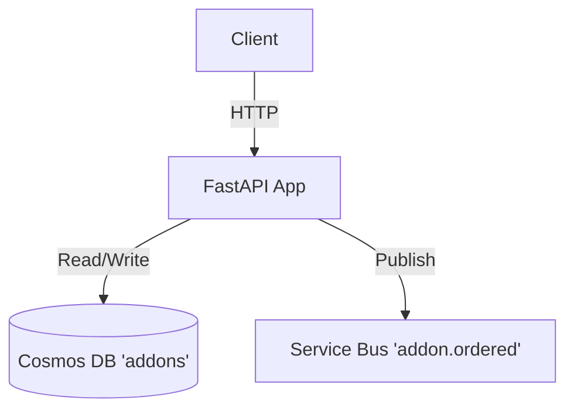

# Service Architecture Snapshot

## Context
The Addon Service manages orders for accessories and experiences.

## Component Diagram

## Data Flow
1.  **Order Addon**: Client POSTs order -> API saves to Cosmos -> Publishes event to Service Bus.
