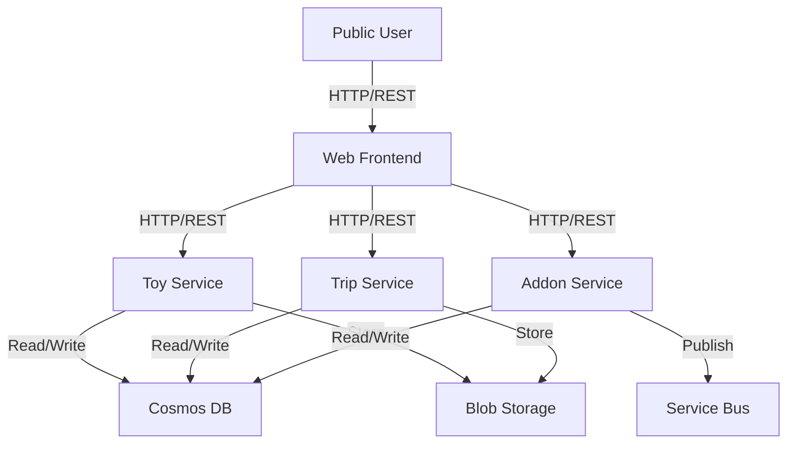

# Architecture Overview

Capture system context, component boundaries, and key decisions that drive implementation.

## Context
The Stuffed Toy World Tour is a public catalog application designed to demonstrate modern microservice patterns on Azure. It allows users to manage toys, trips, and associated media in a collaborative, open environment. The system is built to be deployed on Azure Container Apps (ACA) and uses Azure managed services for data and messaging.

## Views

### System Context Diagram

### Container / Service View
| Component | Responsibility | Tech Stack | Deployment Target | Owners |
| --- | --- | --- | --- | --- |
| **Web** | Frontend SPA | React, Vite | ACA / Static Web Apps | Frontend Team |
| **Toy Service** | Manage toy profiles | Python, FastAPI | ACA | Backend Team |
| **Trip Service** | Manage trips and galleries | Python, FastAPI | ACA | Backend Team |
| **Addon Service** | Manage orders and fulfillment | Python, FastAPI | ACA | Backend Team |

### Data Flow
- **Synchronous**: Frontend calls services via REST.
- **Asynchronous**: Addon service publishes `addon.ordered` events.

## Cross-Cutting Concerns
- **Security**: Public access (no auth). HTTPS for all transport.
- **Performance**: Stateless services, scalable via KEDA (based on HTTP traffic or Queue depth).
- **Resilience**: Retries on transient failures (Cosmos 429, Network).
- **Observability**: Centralized OTEL collection.

## Dependencies
- **Azure Cosmos DB**: NoSQL database.
- **Azure Blob Storage**: Object storage for images.
- **Azure Service Bus**: Message broker.

## Specification by Example
- **Given** a user orders an addon, **Then** the Addon service publishes an event.

## Decision References
- **Deployment**: Azure Container Apps for simplified serverless container management.
- **Database**: Cosmos DB for schema flexibility and scalability.
- **No Auth**: Decision to remove authentication to simplify the demo and focus on architecture.
