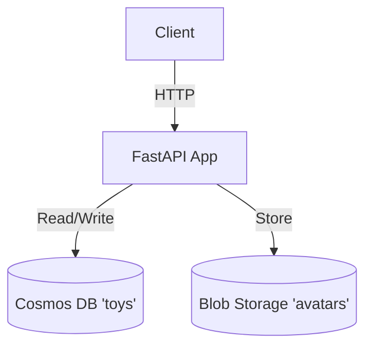

# Service Architecture Snapshot

Provide a focused view of how this service fits into the broader system while inheriting global context from `../../platform/ARCHITECTURE.md`.

## Context
The Toy Service is responsible for managing the registry of stuffed toys. It stores toy profiles and their avatar images.

## Component Diagram

## Data Flow
1.  **Register Toy**: Client POSTs toy data -> API saves to Cosmos DB.
2.  **Upload Avatar**: Client POSTs image -> API saves to Blob Storage -> Updates Cosmos DB with blob URL.

## Cross-Cutting Concerns
-   **Resilience**: Retries on Cosmos DB 429 errors.
-   **Performance**: Cache popular toy profiles (future).
