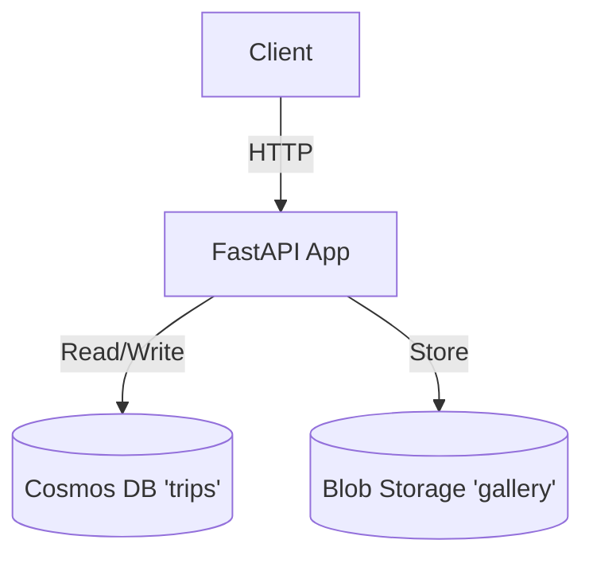

# Service Architecture Snapshot

Provide a focused view of how this service fits into the broader system while inheriting global context from `../../platform/ARCHITECTURE.md`.

## Context
The Trip Service manages trips taken by toys and the photo galleries associated with them.

## Component Diagram

## Data Flow
1.  **Create Trip**: Client POSTs trip data -> API saves to Cosmos DB.
2.  **Upload Gallery Image**: Client POSTs image -> API saves to Blob Storage -> Updates Cosmos DB with blob URL.

## Cross-Cutting Concerns
-   **Resilience**: Retries on Cosmos DB 429 errors.
